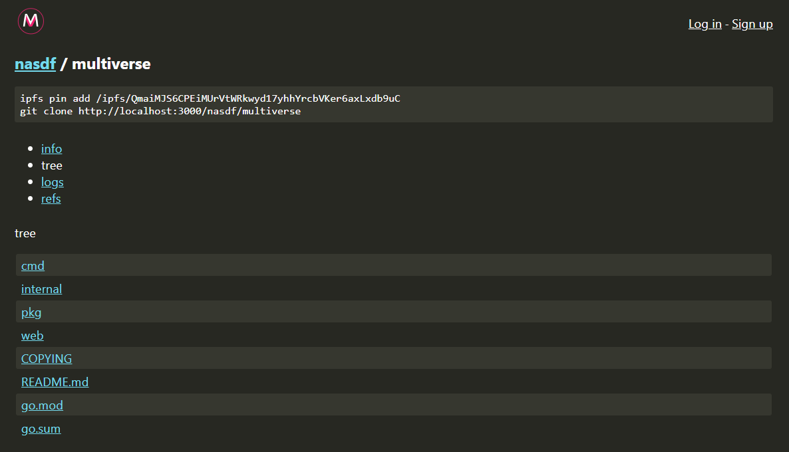

# Multiverse

A git compatible decentralized code hosting server.



### About

Multiverse leverages the [go-git](https://github.com/go-git/go-git) storer interface to provide an [IPFS](https://github.com/ipfs/go-ipfs) storage backend for your git repositories.

The server is a self contained binary with an embedded web server, database, and IPFS node.

Once your code is uploaded you can use pinning services or filecoin for long term archival.

### Install

Go 1.16 or higher required.

```bash
$ git clone https://github.com/multiverse-vcs/multiverse
$ cd multiverse
$ go install ./cmd/multiverse
$ multiverse
```

### Contributing

Found a bug or have a feature request? [Open an issue](https://github.com/multiverse-vcs/multiverse/issues/new).

Multiverse follows the [Contributor Covenant](https://contributor-covenant.org/version/2/0/code_of_conduct/) Code of Conduct.

### License

GNU Affero General Public License v3.0
